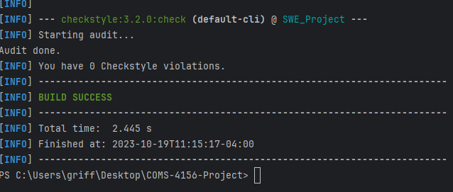
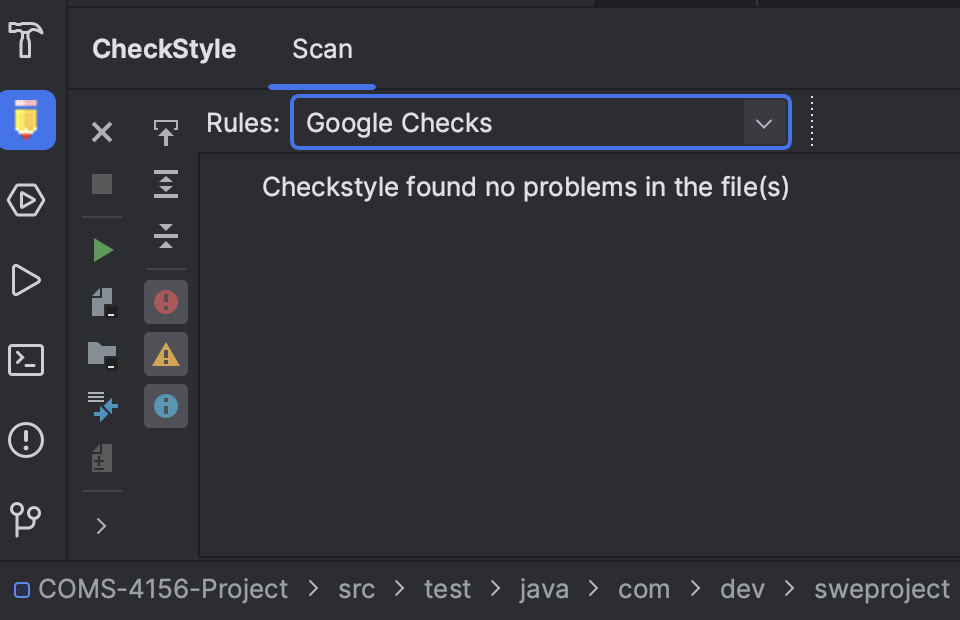

# COMS-4156-Project
GitHub Repo for Team Project

## Building and Running
You can build our project using the build command in IntelliJ using Java 17. From there, you can hit the "Run" button to start
the service.

Our endpoints are listed below in the "Endpoints" section, with brief descriptions of their parameters. For in-depth examples and system-level
tests of them, see the section "Postman Test Documentation" below.

## Running Tests
Our unit tests are located under the directory 'src/test'. To run our project's tests in IntelliJ using Java 17, you must first build the project.

From there, you can right-click the 'DocumentTest' class from the IntelliJ Project View and click "Run 'DocumentTest'".
Next, you can do the same thing with 'FirebaseServiceTest' to run the tests of the Firebase service.

To see our system-level tests, see the section "Postman Test Documentation" below.

## Style Checking Report
We used the tool "checkstyle" to check the style of our code and generate style checking reports. Here is the report
as of the day of 10/19/23:

## Postman Test Documentation
View the list of API calls made over the network using post man fully documented with the received result and parameters: https://documenter.getpostman.com/view/30499865/2s9YR85tUY

## Endpoints
This section describes the endpoints that our service provides, as well as their inputs and outputs. See the
"Postman Test Documentation" section for in-depth examples of use cases and inputs/outputs, especially for file
uploads and downloads.

#### POST /register-client
* This API registers a client application, and returns a network ID that the client
can use to access the service's other endpoints. You MUST call this endpoint prior to any others to register
your client application.
* Input: N/A
* Output: network_id (string)

#### POST /upload-doc
* This API uploads a document, which may be entirely new or a new version of an existing document.
If there are now more than three versions of the document, the oldest is deleted.
* Input: network-id (string), document-name (string), user-id (string), contents (raw file contents, in the request body)
* Output: N/A

#### GET /download-doc
* This API retrieves the latest version of a document, if your user ID has access to the document.
* Input: network-id (string), document-name (string), your-user-id (string)
* Output: The raw text contents of the document in the response body.

#### DEL /delete-doc
* This API deletes all versions of a specified document, if your user ID has access to the document.
* Input: network-id (string), document-name (string), your-user-id (string)
* Output: N/A

#### GET /check-for-doc
* This API checks if a specified document exists, and, if it does, returns information on the document, if your user ID has access to the document.
* Input: network-id (string), document-name (string), your-user-id (string)
* Output: A JSON object containing the following fields:
* * clientId (string): the network-id
* * wordCount (integer): the word count of the document
* * docId (string): a unique document ID
* * title (string): the document-name
* * userId (string): the users with access to this document, represented as a string with '/' characters separating individual user IDs
* * fileString (string): The Base64 encoded document text.
* * previousVersions (list): A JSON list of up to 3 previous versions of the document, with each list entry containing the following fields:
* * * clientId (string): see above
* * * wordCount (integer): see above
* * * docId (string): see above
* * * title (string): see above
* * * userId (string): see above
* * * fileString (string): see above

#### GET /see-previous-version
* This API gets a prior version of a document, if your user ID has access to the document.
* Input: network-id (string), document-name (string), your-user-id (string), revision-number (integer)
* Output: A JSON object containing the following fields:
* * clientId (string): see description under 'GET /check-for-doc'
* * wordCount (integer): see above
* * docId (string): see above
* * title (string): see above
* * userId (string): see above
* * fileString (string): see above

#### PATCH /share-document
* This API shares a document you have access to with another user, allowing them to access it.
* Input: network-id (string), document-name (string), your-user-id (string), their-user-id (string)
* Output: A string indicating the result of the operation.

#### GET /see-document-stats
* This API gets document statistics in a human-readable string format, if you have access to it.
* Input: network-id (string), document-name (string), your-user-id (string)
* Output: A string containing document information, including word count, how many users have access, and number of revisions stored.

#### GET /generate-difference-summary
* This API generates a simple difference summary between two different documents, if you have access to both.
* Input: network-id (string), fst-doc-name (string representing the first document name), snd-doc-name (string representing the second document name), your-user-id (string)
* Output: A string containing difference information between the two given documents, including word count difference, user count difference, and version count difference.

## Tools used
This section includes notes on tools and technologies used in building this project, as well as any additional details if applicable.

* Firebase DB
* Maven Package Manager
* GitHub Actions CI
  * This is enabled via the "Actions" tab on GitHub.
  * Currently, this just runs a Maven build to make sure the code builds on branch 'main'.
* Checkstyle
  * We use Checkstyle for code reporting. Note that Checkstyle does NOT get run as part of the CI pipeline.
  * For running Checkstyle manually, you can use the "Checkstyle-IDEA" plugin for IntelliJ.
* SonarQube
  * TODO: Will do static analysis with SonarQube in second iteration.
* JUnit
  * JUnit tests get run automatically as part of the CI pipeline.
* Cobertura
  * We use Cobertura for generating code coverage reports.
* Postman
  * We used Postman for testing that the APIs work.
